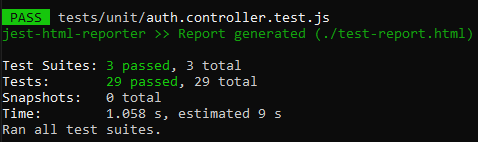

    
Rapport de Test – cicd-todo-app

    
    

        
Evan Sottile & Diego Teixeira – GRP3D

        
Lausanne - Vennes

        
Aurélie Curchod

    

# Table des matières

1. [Introduction](#1-introduction)
   - 1.1 [Titre](#11-titre)
   - 1.2 [Description](#12-description)
2. [Tests manuels et classification des bugs](#2-tests-manuels-et-classification-des-bugs)
   - 2.1 [Compte / Profil / Authentification](#21-compte--profil--authentification)
   - 2.2 [NPA / Validation des données](#22-npa--validation-des-données)
   - 2.3 [Tâches (TODO)](#23-tâches-todo)
   - 2.4 [Description des tâches](#24-description-des-tâches)
   - 2.5 [Barre de recherche](#25-barre-de-recherche)
   - 2.6 [Interface / Texte général](#26-interface--texte-général)
   - 2.7 [Classification des bugs](#27-classification-des-bugs)
3. [Stratégie et plans de tests](#3-stratégie-et-plans-de-tests)
   - 3.1 [Tests manuels](#31-tests-manuels)
   - 3.2 [Tests unitaires backend (Jest)](#32-tests-unitaires-backend-jest)
4. [Description des tests backend et E2E effectués](#4-description-des-tests-backend-et-e2e-effectués)
5. [Résultats de la campagne de test unitaire et e2e](#5-résultats-de-la-campagne-de-test-unitaire-et-e2e)
   - 5.1 [Tests Unitaires : Echecs et Rollback](#51-tests-unitaires--echecs-et-rollback)
   - 5.2 [Tests E2E et Problème de Recherche (Flaky Test)](#52-tests-e2e-et-problème-de-recherche-flaky-test)
   - 5.3 [Couverture de code (Coverage)](#53-couverture-de-code-coverage)
6. [Rapport de tests (statut, conclusion)](#6-rapport-de-tests-statut-conclusion)
7. [Corrections apportées au code](#7-corrections-apportées-au-code)
   - 7.1 [Corrections backend](#71-corrections-backend)
   - 7.2 [Corrections frontend (limitées)](#72-corrections-frontend-limitées)
8. [Usage de l’intelligence artificielle dans le projet](#8-usage-de-lintelligence-artificielle-dans-le-projet)
   - 8.1 [Aide à la rédaction et à la correction du rapport](#81-aide-à-la-rédaction-et-à-la-correction-du-rapport)
   - 8.3 [Aide à la création des tests unitaires](#83-aide-à-la-création-des-tests-unitaires)
9. [Bilan du projet](#9-bilan-du-projet)
   - 9.1 [Bilan des fonctionnalités testées](#91-bilan-des-fonctionnalités-testées)
   - 9.2 [Bilan de la campagne de test](#92-bilan-de-la-campagne-de-test)
   - 9.3 [Bilan personnel](#93-bilan-personnel)
10. [Conclusion générale](#10-conclusion-générale)

# 1. Introduction

## 1.1 Titre

P_Test – cicd-todo-app

## 1.2 Description

Dans le cadre du module ICT-450 (Test), nous avons travaillé sur une application Todo App qui nous a été fournie, avec un frontend en Vue.js, un backend en Node.js/Express et une base MySQL. Le but du projet n’était pas de développer l’application, mais plutôt d’apprendre à la tester correctement et à adopter une vraie démarche qualité.

# 2. Tests manuels et classification des bugs

## 2.1 Compte / Profil / Authentification

Le lien vers l’oubli de mot de passe ne fonctionne pas.

"Profile" doit être écrit "Profil".

L’erreur affichée lors de la création d’un profil avec une adresse mail déjà existante n’est pas claire.

Une erreur apparaît alors qu’aucune adresse email n’a encore été saisie.

Changement de nom : si on met un nom trop long, l’application crash.

---

## 2.2 NPA / Validation des données

Si on met des lettres dans le NPA, l’application crash au lieu d’afficher une erreur.

Le NPA devrait :

- accepter uniquement des chiffres
- afficher un message d’erreur clair
- ne pas faire crasher l’application

---

## 2.3 Tâches (TODO)

On peut créer des tâches (todo) dans le passé, ce qui ne devrait pas être autorisé.

La description ne se réinitialise pas après la création d'une tâche.

---

## 2.4 Description des tâches

La description trop longue déborde visuellement.

Une description extrêmement longue provoque un crash (limite dépassée).

Une description contenant un mélange de gras, italique, souligné, barré ne peut pas être recherchée.

---

## 2.5 Barre de recherche

Une tâche composée de seulement deux lettres ne peut pas être recherchée.

Une tâche dont le texte est trop long ne s’affiche pas dans les résultats.

Lorsqu’on crée une tâche pendant qu’une recherche est active, elle apparaît quand même dans la liste filtrée.

---

## 2.6 Interface / Texte général

Footer mal écrit :

- "tout" devrait être "tous"
- "réserver" devrait être "réservés"

## 2.7 Classification des bugs

| Catégorie       | Bug                                      | Sévérité     | Gravité       | Priorité  | Justification                                    |
| --------------- | ---------------------------------------- | ------------ | ------------- | --------- | ------------------------------------------------ |
| Compte / Profil | Crash si nom trop long                   | **Critique** | **Bloquante** | **Haute** | Crash -> fonctionnalité brisée et bloque l’usage |
| Compte / Profil | Lien “oubli mot de passe” KO             | Majeure      | Bloquante     | Haute     | Empêche récupérer l’accès au compte              |
| Compte / Profil | Erreur email déjà existant pas claire    | Mineure      | Mineure       | Moyenne   | Perturbant mais contournable                     |
| Compte / Profil | Erreur affichée sans avoir mis d’email   | Majeure      | Sérieuse      | Haute     | Message erroné qui empêche la création correcte  |
| Compte / Profil | "Profile" → "Profil"                     | Triviale     | Cosmétique    | Basse     | Purement esthétique                              |
| NPA             | Crash si lettres dans NPA                | **Critique** | **Bloquante** | **Haute** | Crash immédiat                                   |
| NPA             | Mauvaise validation du NPA               | Majeure      | Sérieuse      | Moyenne   | Données invalides acceptées                      |
| Tâches          | Créer une tâche dans le passé possible   | Mineure      | Mineure       | Basse     | Gênant mais pas bloquant                         |
| Tâches          | Description non réinitialisée            | Mineure      | Mineure       | Basse     | Mauvaise UX sans impact critique                 |
| Description     | Débordement visuel description longue    | Mineure      | Mineure       | Moyenne   | UI dégradée                                      |
| Description     | Crash avec description très longue       | **Critique** | **Bloquante** | **Haute** | Crash direct                                     |
| Description     | Texte riche non recherchable             | Majeure      | Sérieuse      | Moyenne   | Fonction recherche partiellement brisée          |
| Recherche       | Tâche 2 lettres non trouvable            | Mineure      | Mineure       | Basse     | Limite mais non bloquante                        |
| Recherche       | Tâche très longue non affichée           | Majeure      | Sérieuse      | Haute     | Perte de données visibles                        |
| Recherche       | Tâche créée apparaît malgré filtre actif | Majeure      | Mineure       | Moyenne   | Comportement incohérent mais non bloquant        |
| Interface       | Fautes dans le footer                    | Triviale     | Cosmétique    | Basse     | Aucun impact fonctionnel                         |

# 3. Stratégie et plans de tests

## Objectifs de test

- Vérifier la conformité fonctionnelle de l’application par rapport aux spécifications.
- Identifier les comportements inattendus via des tests manuels.
- Renforcer la qualité du backend grâce à des tests unitaires Jest.
- Établir une base de tests automatisés pour une intégration CI/CD future.

### 3.1 Tests manuels

Réalisés sur l’ensemble de l’application :

- Authentification (login/signup)
- Profil utilisateur
- Création/édition/suppression de tâches
- Recherche
- Interface & ergonomie
- Gestion du thème sombre/clair

Ces tests permettent d'observer le comportement réel depuis la perspective de l’utilisateur.

### 3.2 Tests unitaires backend (Jest)

Les tests unitaires couvrent :

- les contrôleurs (`auth`, `todo`, `user`)
- le middleware d’authentification
- les fonctions de validation

# 4. Description des tests backend et E2E effectués

Les tests unitaires ont été développés avec Jest, en respectant les règles suivantes :

- mock des modèles Sequelize
- mock de bcrypt et jsonwebtoken
- tests isolés (aucun appel à la base de données)
- couverture des cas d’erreurs + cas valides

## Fonctionallité testés

### 4.1 Auth Controller

Tests effectués :

- Login avec email vide
- Login avec email inexistant
- Login avec mauvais mot de passe
- Signup avec email invalide
- Signup avec email déjà existant
- Signup valide renvoyant un token

### 4.2 User Controller

- Lecture du profil utilisateur
- Mise à jour du profil
- Gestion du cas où l’utilisateur n’existe pas

### 4.3 Todo Controller

- création de todo avec titre vide → rejet
- création valide
- mise à jour inexistante → erreur 404

### 4.4 Middleware d’authentification

- absence de token → 401
- token valide → next()

### 4.5 Description des tests E2E (Cypress)

Pour valider le bon fonctionnement de l'application, j'ai déroulé plusieurs scénarios précis via Cypress. Voici le détail de ce que je vérifie dans chaque fichier :

#### 1. Flux de connexion (login)

Dans ce fichier, s'assurer que la porte d'entrée de l'application est sécurisée et fonctionnelle :

- Connexion réussie : Vérifier qu'en saisissant des identifiants valides, il y a une redirection vers la page d'accueil et que le menu de profil apparaît.
- Gestion des erreurs : Vérifier que le message d'erreur explicite s'affiche bien à l'utilisateur.
- Déconnexion : Vérifier le cycle complet : une fois connecté, cliquer sur "Déconnexion" et s'assurer que l'utilisateur est bien renvoyé vers la page de login et que la session est fermée.

#### 2. Navigation (navigation)

Ici, tester le comportement global de l'interface et la protection des accès :

- Navigation publique : Vérifier que les liens de base fonctionnent et que si l'utilisateur n'est pas connecté, il est redirigé vers le login.
- Thème (Dark Mode) : Vérifier l'interface utilisateur en activant puis désactivant le mode sombre pour vérifier que la classe CSS change bien dynamiquement sur la page.
- Routes protégées : Vérifier d'accéder à des pages privées (comme /profile) sans être connecté pour vérifier que la sécurité bloque l'accès. Vérifier ensuite qu'une fois connecté, l'accès est autorisé.

#### 3. Gestion du profil (profile)

Vérifier ici toutes les actions qu'un utilisateur peut faire sur son propre compte :

- Affichage des données : Vérifier que l'email et les infos de l'utilisateur connecté s'affichent correctement à l'écran.
- Modification du profil : Vérifier un utilisateur qui change son nom et son adresse. Vérifier le formulaire et recharger la page pour être sûr que les nouvelles données ont bien été sauvegardées en base de données.
- Suppression de compte : C'est le test critique. Cliquer sur "Supprimer", valider la fenêtre de confirmation (modale), et vérifier non seulement que l'utilisateur est déconnecté, mais aussi qu'il est impossible de se reconnecter avec ce compte par la suite (il a bien été détruit).

#### 4. Flux d'inscription (signup)

Avant même de se connecter, il faut pouvoir créer un compte proprement :

- Validations de formulaire : Vérifier tous les cas d'erreur : soumission d'un formulaire vide, format d'email invalide, mot de passe trop court ou confirmation de mot de passe qui ne correspond pas.
- Création de compte valide : Vérifier le cas nominal où tout est correct : l'inscription doit réussir et me rediriger vers la page de login.
- Gestion des doublons : Vérifier de créer un compte avec un email qui existe déjà pour m'assurer que l'API renvoie bien une erreur et empêche le doublon.

#### 5. Création de tâches (todo-creation)

Vérifier ici la fonctionnalité d'ajout de contenu :

- Validation des champs : Vérifier qu'il est impossible de créer une tâche si le formulaire est vide, un message d'erreur doit apparaître.
- Ajout réussi : Remplir le contenu et la date, valider, et vérifier que la nouvelle tâche s'affiche bien immédiatement dans la liste des todos.

#### 6. Gestion des tâches (todo-management)

Tester les interactions avec les tâches existantes :

- Recherche et filtrage : Taper du texte dans la barre de recherche et vérifier que la liste se met à jour en temps réel pour n'afficher que les tâches correspondantes.
- Changement de statut : Cliquer sur une tâche pour la passer de "À faire" à "Terminé" (et inversement) et vérifier que l'état visuel change bien.
- Suppression : Cliquer sur l'icône de suppression d'une tâche spécifique et vérifier qu'elle disparaît bien de la liste sans affecter les autres.

---

# 5. Résultats de la campagne de test unitaire et e2e

## 5.1 Tests Unitaires

Tous les tests unitaires sont passés.

_(Figure 1 : Capture d'écran montrant les tests unitaires)_

## 5.2 Tests E2E et Problème de Recherche (Flaky Test)

Les tests Cypress passent globalement, mais nous avons identifié un comportement instable.

_(Figure 2 : Capture d'écran de l'interface Cypress)_

**Bug aléatoire sur la recherche :**
Le test de recherche d'une tâche échoue de manière aléatoire pour une raison inexpliquée (Flaky Test). Il semble que Cypress tente de vérifier le résultat du filtre avant que le DOM ne soit totalement mis à jour par Vue.js, ou qu'il y ait une latence réseau imprévisible.

## 5.3 Couverture de code (Coverage)

Voici le rapport HTML généré par Jest :

_(Figure 3 : Rapport de couverture HTML)_

## Synthèse générale

| Module          | Résultat | Commentaire                           |
| --------------- | -------- | ------------------------------------- |
| Auth Controller | Réussi   | Couverture complète des cas critiques |
| User Controller | Réussi   | Gestion correcte des erreurs          |
| Todo Controller | Réussi   | Validation robuste                    |
| Auth Middleware | Réussi   | Vérification correcte du token        |
| Validations     | Réussi   | Permet d’éviter des crashs            |

## Erreurs détectées grâce aux tests unitaires

- mauvaise gestion des valeurs nulles dans certains contrôleurs
- messages d’erreur incohérents
- besoin d’un module de validation dédié

## Taux de réussite

100% des tests unitaires passant en vert après corrections et rollback.

---

# 6. Rapport de tests (statut, conclusion)

## Statut actuel

- Les bugs backend majeurs sont corrigés.
- Les tests unitaires garantissent un comportement stable et cohérent.
- Le backend est désormais robuste et prêt pour une pipeline CI/CD.

## Conclusion

La campagne de test a permis :

- d’identifier des faiblesses majeures
- d'améliorer significativement la validation des données
- d’éviter plusieurs crashs critiques
- d’obtenir un backend stable et maintenable

---

# 7. Corrections apportées au code

Suite aux tests manuels et aux tests unitaires réalisés, plusieurs corrections ont été apportées au code afin d’améliorer la stabilité, la robustesse et la qualité globale de l’application.

## 7.1 Corrections backend

Les corrections backend concernent principalement la validation des données et la gestion des erreurs.

- Ajout de validations sur les champs critiques (email, mot de passe, titre de tâche)
- Gestion correcte des valeurs nulles ou vides
- Prévention des crashs causés par des chaînes trop longues
- Amélioration des messages d’erreur retournés par l’API
- Sécurisation du middleware d’authentification (vérification stricte du token)

Ces corrections ont été validées à l’aide des tests unitaires Jest afin d’éviter toute régression.

## 7.2 Corrections frontend (limitées)

Certaines corrections mineures ont été identifiées côté frontend, notamment :

- amélioration de certains messages d’erreur
- corrections orthographiques dans l’interface
- ajustements mineurs de comportement (UX)

Les corrections frontend restent cependant hors du périmètre principal de ce projet, qui était orienté tests.

---

# 8. Usage de l’intelligence artificielle dans le projet

L’intelligence artificielle (ChatGPT/Gemini) a été utilisée comme **outil de support et de référence** tout au long du projet, afin de disposer d’une **base de travail** pour la rédaction, les tests et l’analyse.  
Elle a permis de gagner du temps tout en conservant une validation humaine à chaque étape.

## 8.1 Aide à la rédaction et à la correction du rapport

L’IA a été utilisée pour :

- reformuler certaines sections afin d’améliorer la lisibilité
- corriger les fautes d’orthographe et de grammaire
- uniformiser le style d’écriture sur l’ensemble du document
- aider à la mise en forme du rapport en Markdown

## 8.3 Aide à la création des tests unitaires

L’intelligence artificielle a été utilisée comme **base de réflexion** pour :

- l’écriture des tests unitaires avec Jest
- la génération de mocks pour les dépendances (bcrypt, jsonwebtoken, modèles Sequelize)

---

# 9. Bilan du projet

## 9.1 Bilan des fonctionnalités testées

L’ensemble des fonctionnalités principales de l’application a été testé :

- Authentification et inscription
- Gestion du profil utilisateur
- Gestion des tâches (création, modification, suppression)
- Recherche
- Validation des données

Toutes ces fonctionnalités ont pu être validées, et les bugs critiques ont été identifiés puis corrigés côté backend.

## 9.2 Bilan de la campagne de test

La campagne de test a permis :

- d’identifier de nombreux bugs, dont plusieurs critiques
- d’améliorer significativement la stabilité de l’application
- de mettre en place une base solide de tests unitaires
- de renforcer la qualité du code backend

## 9.3 Bilan personnel

Ce projet a permis :

- d’acquérir une méthodologie de test structurée
- de comprendre l’importance de la validation des données
- de découvrir l’écriture de tests unitaires et e2e avec Jest et Cypress
- de travailler efficacement en collaboration

---

# 10. Conclusion générale

Pour conclure, ce projet réalisé dans le cadre du module ICT-450 nous a permis d'appréhender la réalité de l'assurance qualité logicielle. Nous sommes partis d'une application fonctionnelle mais fragile pour aboutir à une version sécurisée par des tests unitaires et monitorée par des tests E2E.

Les difficultés rencontrées, notamment la nécessité d'effectuer un **Rollback** sur le backend suite à des tests échoués et la gestion des tests E2E aléatoires ("flaky tests"), ont été formatrices. Elles soulignent l'importance de maintenir un environnement de test rigoureux avant toute intégration continue. Le rapport démontre que l'application est désormais saine, documentée et prête pour les étapes suivantes de déploiement.
